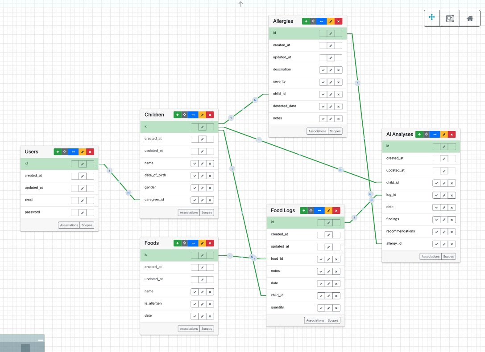
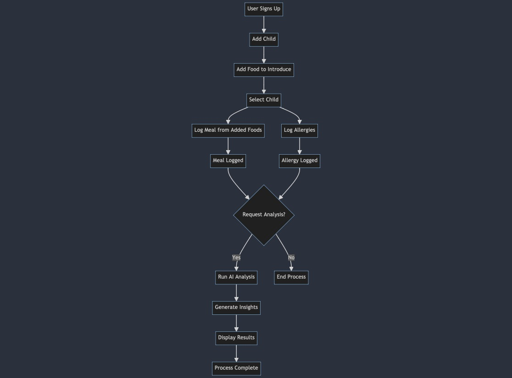

# BiteBuddy

BiteBuddy is a platform designed to help caregivers log their child's meals and reactions to monitor and identify potential food allergies. The platform provides tools for tracking, analyzing, and managing allergies to ensure the safety and well-being of infants and toddlers.

## Table of Contents
- [Project Overview](#project-overview)
  - [Features](#features)
- [Technologies Used](#technologies-used)
  - [Additional Gems Added to the Application](#additional-gems-added-to-the-application)
    - [Development Gems](#development-gems)
    - [Test Gems](#test-gems)
- [Services Used](#services-used-⛓️)
  - [OpenAI ChatGPT API Configuration](#openai-chatgpt-api)
- [Installation](#installation)
- [Usage](#usage)
  - [Key Sections](#key-sections)
- [Database](#database)
  - [Key Tables](#key-tables)
  - [Process Flowchart](#process-flowchart-🗺️)
- [Seeding the Database](#seeding-the-database)
- [Contributing](#contributing)
- [Project Management](#project-management)
- [FAQ](#faq-🙋)


## Project Overview

BiteBuddy is built to assist parents and caregivers in monitoring their children's dietary habits, especially during the early years when food allergies are most likely to develop. The application logs meals, tracks allergic reactions, and uses AI-driven analysis to identify potential food-related allergens.

### Features

- **Meal Logging:** Caregivers can log meals and associated reactions.
- **Allergy Tracking:** Track and monitor potential food allergies.
- **AI-Driven Analysis:** Analyze patterns between food intake and allergic reactions.

## Technologies Used

- **Ruby on Rails:** Back-end framework for web development.`7.0.4.3`
- **Bootstrap:** Front-end framework for responsive design.
- **Faker:** Gem for generating sample data.
- **Devise:** Authentication solution for Rails.
- **OpenAI:** Used for AI-driven analysis of food and allergy data.

### Additional Gems Added to the Application

- [`appdev_support`](https://github.com/firstdraft/appdev_support): Provides additional support and utilities for AppDev projects.
- [`annotate`](https://github.com/ctran/annotate_models): Automatically adds schema information to the top of your model files.
- [`awesome_print`](https://github.com/awesome-print/awesome_print): Provides pretty print capabilities for Ruby objects.
- [`dotenv-rails`](https://github.com/bkeepers/dotenv): Loads environment variables from `.env`.
- [`faker`](https://github.com/faker-ruby/faker): A library for generating fake data such as names, addresses, and phone numbers.
- [`htmlbeautifier`](https://github.com/threedaymonk/htmlbeautifier): An HTML formatter for Rails templates.
- [`http`](https://github.com/httprb/http): A simple and flexible HTTP client.
- [`sqlite3`](https://github.com/sparklemotion/sqlite3-ruby): SQLite3 database adapter for Ruby.
- [`table_print`](https://github.com/arches/table_print): A library for pretty-printing tables of ActiveRecord objects.

#### Development Gems

- [`better_errors`](https://github.com/BetterErrors/better_errors): Provides a better error page for Rails and other Rack apps.
- [`binding_of_caller`](https://github.com/banister/binding_of_caller): A debugging tool that provides access to bindings and variables.
- [`draft_generators`](https://github.com/firstdraft/draft_generators): Rails generators for building out scaffolding quickly.
- [`grade_runner`](https://github.com/firstdraft/grade_runner): A tool for grading student assignments in AppDev courses.
- [`pry-rails`](https://github.com/pry/pry-rails): A runtime developer console for Rails.
- [`rails_db`](https://github.com/igorkasyanchuk/rails_db): A GUI for Rails database management.
- [`rails-erd`](https://github.com/voormedia/rails-erd): A tool to generate Entity-Relationship Diagrams from Rails applications.
- [`rufo`](https://github.com/ruby-formatter/rufo): A Ruby formatter.
- [`specs_to_readme`](https://github.com/firstdraft/specs_to_readme): Generates README documentation from RSpec tests.

#### Test Gems

- [`capybara`](https://github.com/teamcapybara/capybara): Helps you test web applications by simulating how a user would interact with your app.
- [`selenium-webdriver`](https://github.com/SeleniumHQ/selenium): A browser automation framework and ecosystem.
- [`webdrivers`](https://github.com/titusfortner/webdrivers): Provides automatic updates of webdrivers for Selenium tests.
- [`rspec-rails`](https://github.com/rspec/rspec-rails): RSpec testing framework for Rails.
- [`draft_matchers`](https://github.com/firstdraft/draft_matchers): Custom matchers for RSpec.
- [`rspec-html-matchers`](https://github.com/kucaahbe/rspec-html-matchers): Provides RSpec matchers for testing HTML.
- [`webmock`](https://github.com/bblimke/webmock): A library for stubbing HTTP requests in Ruby.


## Services Used ⛓️

### OpenAI ChatGPT API

#### Configuration

To configure your application to use the ChatGPT's OpenAI API, follow these detailed steps:

1. **Generate a Master Key**

   If you do not already have a `master.key` file, you can generate one by running:

   ```bash
   EDITOR="code --wait" rails credentials:edit
   ```
   This command will open the credentials file in Visual Studio Code (replace "code --wait" with your preferred editor, such as nano). A new master.key file will be generated automatically if it does not exist.

2. **Add OpenAI API's Tokens**
    
    Inside the opened credentials file, add your API tokens and other sensitive configuration variables in a structured format. For example:
    ```bash
    open_ai_api_key: YOUR_OPENAI_API_ACCESS_KEY
    ```
    Save and close the file. The changes will be encrypted and saved securely, accessible only via the master.key.
 3. **Double check your configuration**

    If you would like to periodically check your key for reference you can run the command below and it should appear in your terminal.
    ```bash
    rails credentials:show
    ```

 4. **Ensure the Security of the Master Key**

    Never commit your master.key or the credentials file to version control. Add the master.key to your .gitignore file to prevent it from being accidentally pushed to your repository:
    ```bash
    echo 'config/master.key' >> .gitignore
    ```

## Installation

To set up BiteBuddy on your local machine, follow these steps:

1. **Clone the repository:**
    ```bash
    git clone https://github.com/aizatibraimova/BiteBuddy.git
    ```

2. **Navigate to the project directory:**
    ```bash
    cd BiteBuddy
    ```

3. **Install dependencies:**
    ```bash
    bundle install
    ```

4. **Set up the database:**
    ```bash
    rails db:create
    rails db:migrate
    ```

5. **Seed the database with sample data:**
    ```bash
    rails db:seed
    ```

6. **Run the application:**
    ```bash
    rails server
    ```

7. **Open your browser and navigate to:**
    ```bash
    http://localhost:3000
    ```

## Usage

Once the application is running, you can use BiteBuddy to manage and track your child's meals and allergies.

### Key Sections:

- **Navigation:** Use the navigation bar to access different sections like Meals, Allergies, and Analyses.
- **Logging Meals:** Log meals, including the type of food, quantity, and time.
- **Tracking Allergies:** Enter and monitor allergic reactions, including symptoms and severity.
- **Viewing Analyses:** Get AI-driven analysis of logged meals and allergic reactions to identify patterns.

## Database

The database schema includes tables for `Users`, `Children`, `Foods`, `Meals`, `Allergies`, and `Analyses`. Each table is connected through appropriate associations, ensuring the integrity and relationships of the data.



### Key Tables:

- **Users:** Stores user credentials and profiles.
- **Children:** Information about the children being monitored.
- **Foods:** Catalog of foods consumed by the children.
- **Meals:** Logs of meals including the food, quantity, and time.
- **Allergies:** Records of allergic reactions with symptoms and severity.
- **Analyses:** AI-generated insights and patterns from the logged meals and allergic reactions.

### Process Flowchart 🗺️

This flowchart provides a detailed overview of the core processes within the BiteBuddy application, visualized using Mermaid.js. As developers, understanding the flow of data and the sequence of operations is crucial for effective collaboration and feature implementation.

The flowchart represents the key stages in the user journey:
1. **User Sign-Up**: The entry point for new users, where they create an account.
2. **Child Management**: Users add their child to the system, which is essential for associating meals and allergies.
3. **Food Introduction**: Users log the foods they plan to introduce to their child.
4. **Meal Logging**: Users can log meals for their child using the foods they've added. This process is independent and can be performed at any time.
5. **Allergy Logging**: Users can log any allergic reactions their child experiences, also independent of meal logging.
6. **AI Analysis**: If the user requests it, the application runs an AI-driven analysis combining logged meals and allergies to generate insights.
7. **Result Display**: The analysis results are displayed to the user but are not stored in the system.




## Seeding the Database

To populate your local database with sample data, run:

```bash
rails db:seed
```

### Contributing
1. Fork the repository 
2. Create a new branch 
```bash
git checkout -b feature-branch
```
3. Make your changes.
```bash
git add .
```
4. Commit your changes 
```bash
git commit -m 'Add some feature'
```
5. Push to the branch
```bash
git push origin feature-branch
```
6. Open a Pull Request.


## Project Management

I am actively managing the development of the **BiteBuddy** app using GitHub Projects. You can follow along with the progress, view tasks, and see what's coming up next in the project by visiting the project board:

[](https://github.com/users/aizatibraimova/projects/1)


## FAQ 🙋

### 1. Master Key Errors
If you encounter issues when setting up the project related to the master key, be sure to follow the Configuration Instructions provided in the [Configuration](#configuration) section of this README.

### 2. OpenAI API Configuration
For help with configuring and using the OpenAI ChatGPT API, refer to the official documentation [here](https://beta.openai.com/docs/).

### 3. Ruby Version Errors
The project is written using Ruby 3.2.1. If you encounter issues upon cloning or running the project, make sure your environment is set up with Ruby version 3.2.1. For more details, see the [Ruby Language documentation](https://www.ruby-lang.org/en/documentation/).
